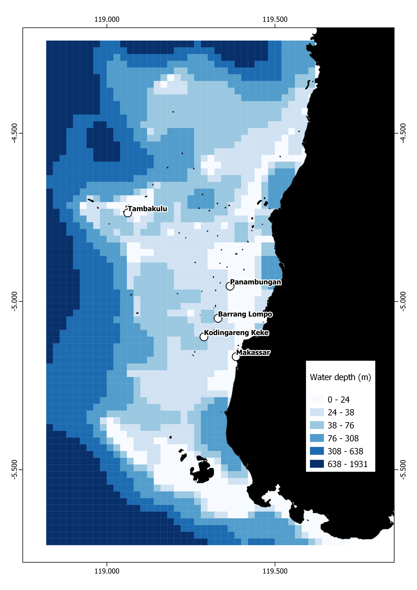
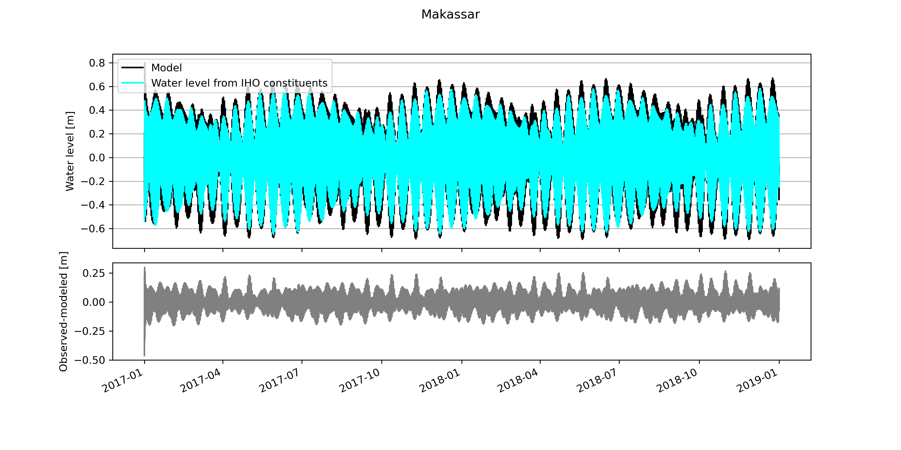
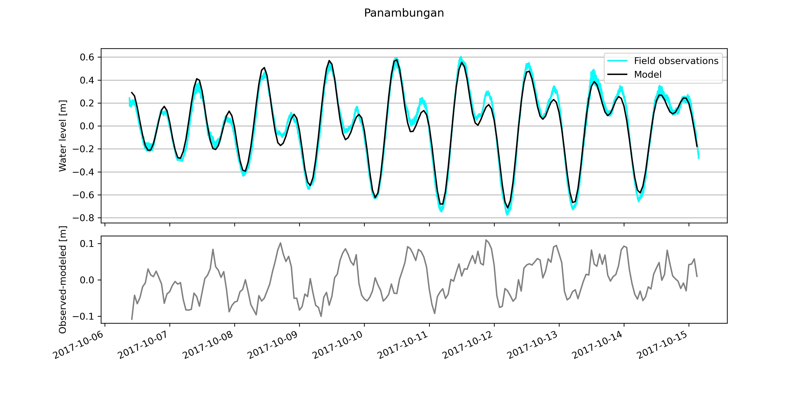
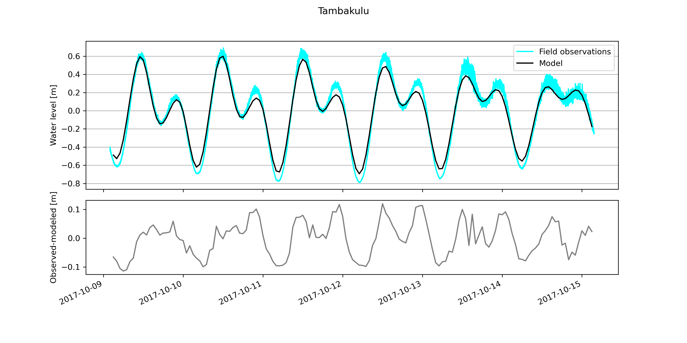

# Tidal model of the Spermonde Archipelago
This repository contains the results of a DELFT 3D model run, that simulates tides in the Spermonde Archipelago from Jan 1 2017 to Jan 1 2019. The model was set up with Delft Dashboard, following the tutorial at this link: https://www.youtube.com/watch?v=t3grdR4rYVY

A detailed description of Delft Dashboard can be found here:
> van Ormondt, M., Nederhoff, K. and van Dongeren, A., 2020. Delft Dashboard: a quick set-up tool for hydrodynamic models. Journal of Hydroinformatics, 22(3), pp.510-527.

## Model files
The model files (DELFT 3D model files and resulting NEFIS map file) are available via ZENODO: 
The NEFIS files can be opened via QuickPlot (DELFT 3D) or OpenEarthTools. The Zenodo repository also contains a \*.mat file exported with QuickPlot, that can be opened with Matlab or Octave. 

## Model boundary conditions
Boundary conditions were derived from astronomic forcing from the TPXO 7.2 Global Inverse tide model, described here:

> Egbert, Gary D., and Svetlana Y. Erofeeva. "Efficient inverse modeling of barotropic ocean tides." Journal of Atmospheric and Oceanic Technology 19.2 (2002): 183-204.

Bathymetric data were downloaded from GEBCO:

> GEBCO Compilation Group (2020) GEBCO 2020 Grid (doi:10.5285/a29c5465-b138-234d-e053-6c86abc040b9)

The model has a grid size of 2x2km, and covers the extent of the Spermonde Archipelago. The following image shows the gridded bathymetry for the tidal model, and validation sites.
 

## Validation
The model was validated in two ways. First, we used the IHO database built into Delft Dashboard and compred it with our modeled data for the entire simulation time. The result is shown in the figure below.

Second, we used the water levels surveyed at different islands of the Spermonde Archipelago by Bender et al., 2020 (Climate of the Past) available here:

> Bender, Maren; Mann, Thomas; Stocchi, Paolo; Kneer, Dominik; Schöne, Tilo; Illigner, Julia; Jompa, Jamaluddin; Rovere, Alessio (2020): Fossil Microatoll radiocarbon and elevation records from the Spermonde Archipelago in SW Sulawesi, Indonesia, 2017. PANGAEA, https://doi.org/10.1594/PANGAEA.917694

The results are shown in the graphs below

The python notebooks used to make these plots are available in this repository.

## Results
In general, despite the coarse resolution of the model and underlying bathymetry, the model gives a very good first approximation of water levels in the Spermonde Archipelago. Comparison with the (few) available data shows that the model reproduces tidal ranges at differet sites with an accuracy of 20 cm or better. Despite these encouraging results, this model is provided with NO WARRANTY WATSOEVER, and above all should not be used for navigation or planning purposes.
Improving these results would require:
- a better bathymetry, also including the very shallow waters around the islands
- more validation datapoints, over a longer period of time
- improved boundary conditions

## Acknowledgments
